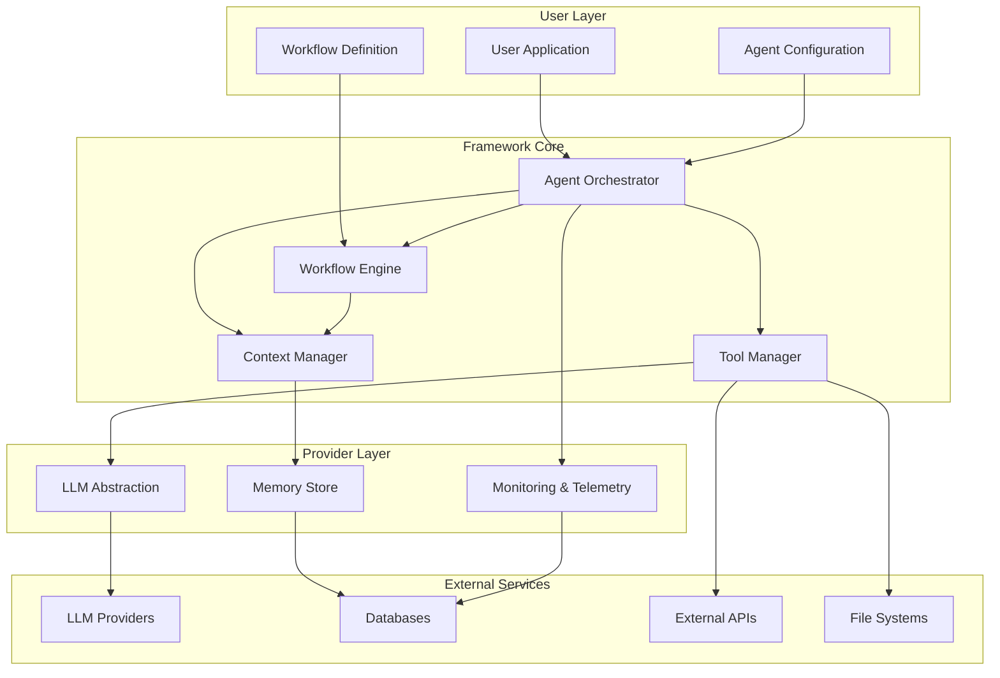

# Design Document

## Overview

Agentic Framework는 AI Agent 시스템 구축을 위한 경량화된 프레임워크입니다. 개발자들이 복잡한 인프라 구현 대신 비즈니스 로직에 집중할 수 있도록 핵심 기능들을 추상화하여 제공합니다. 프레임워크는 모듈러 아키텍처를 채택하여 필요한 기능만 선택적으로 사용할 수 있도록 설계되었습니다.

## Architecture

## Components and Problem-Solution Approach

### 1. Agent Orchestrator

**Purpose**: 여러 에이전트의 생명주기 관리 및 협업 조정

**Problems to Solve**:

- 여러 에이전트가 동시에 실행될 때 리소스 경합과 상태 충돌 방지
- 에이전트 간 메시지 전달 및 응답 대기 메커니즘
- 에이전트 실행 실패 시 복구 및 대체 에이전트 활성화
- 에이전트 간 의존성 관리 (A 에이전트 완료 후 B 에이전트 실행)

**Logic to Implement**:

- 에이전트 레지스트리 패턴으로 동적 에이전트 등록/해제 관리
- 메시지 큐 기반 비동기 통신 시스템으로 에이전트 간 협업 지원
- 상태 머신을 통한 에이전트 생명주기 관리 (idle → running → completed → failed)
- Circuit breaker 패턴으로 실패한 에이전트 격리 및 시스템 안정성 확보

**Why Abstract**: 에이전트 간 통신, 상태 관리, 에러 처리는 모든 Agentic 시스템에서 반복되는 복잡한 로직

### 2. Tool Manager

**Purpose**: 외부 서비스 및 API와의 통합을 위한 통합 인터페이스

**Problems to Solve**:

- 다양한 외부 API들의 서로 다른 인증 방식과 호출 패턴 통합
- 네트워크 장애나 서비스 다운타임 시 재시도 및 fallback 처리
- API 호출 결과의 일관된 에러 처리 및 응답 형식 표준화
- 도구별 사용량 제한 및 비용 관리

**Logic to Implement**:

- 플러그인 아키텍처로 새로운 도구를 쉽게 추가할 수 있는 확장 시스템
- Exponential backoff와 jitter를 적용한 지능적 재시도 메커니즘
- 도구별 인증 정보를 안전하게 관리하는 credential store
- 사용량 추적 및 rate limiting을 통한 비용 제어

**Why Abstract**: API 호출, 재시도 로직, 에러 핸들링, 인증 등은 표준화 가능한 반복 작업

### 3. Context Manager

**Purpose**: 대화 기록, 에이전트 간 컨텍스트 공유, 메모리 관리

**Problems to Solve**:

- 긴 대화에서 토큰 제한으로 인한 컨텍스트 손실 문제
- 에이전트 간 중요한 정보 공유 및 동기화
- 대화 기록에서 관련성 높은 정보를 빠르게 검색
- 메모리 사용량 증가에 따른 성능 저하 방지

**Logic to Implement**:

- 계층적 요약 알고리즘으로 중요한 정보는 보존하면서 컨텍스트 압축
- 벡터 임베딩 기반 의미적 검색으로 관련 대화 내용 빠른 검색
- 에이전트별 네임스페이스를 통한 컨텍스트 격리 및 선택적 공유
- LRU 캐시와 같은 메모리 관리 전략으로 성능 최적화

**Why Abstract**: 메모리 관리, 컨텍스트 윈도우 최적화, 벡터 검색은 모든 에이전트가 필요로 하는 공통 기능

### 4. LLM Abstraction Layer

**Purpose**: 다양한 LLM 제공자들에 대한 통합 인터페이스

**Problems to Solve**:

- OpenAI, Anthropic, Google 등 제공자별 API 차이점 흡수
- 모델별 성능과 비용 특성을 고려한 최적 모델 선택
- API 호출 실패 시 다른 제공자로 자동 전환
- 프롬프트 엔지니어링 베스트 프랙티스 적용

**Logic to Implement**:

- 어댑터 패턴으로 제공자별 API 차이를 통합 인터페이스로 추상화
- 모델 성능 메트릭과 비용 정보를 기반으로 한 지능적 라우팅
- 제공자별 fallback 체인과 로드 밸런싱 구현
- 프롬프트 템플릿 시스템으로 일관된 프롬프트 관리

**Why Abstract**: 제공자별 API 차이를 숨기고, 모델 전환을 쉽게 하며, 비용 최적화 로직을 중앙화

### 5. Workflow Engine

**Purpose**: 복잡한 다단계 프로세스의 선언적 정의 및 실행

**Problems to Solve**:

- 복잡한 비즈니스 로직을 단계별로 분해하고 관리
- 워크플로우 실행 중 실패 시 부분 롤백 및 재시작
- 조건부 분기와 병렬 실행을 통한 효율적인 프로세스 처리
- 장시간 실행되는 워크플로우의 상태 지속성

**Logic to Implement**:

- 상태 머신 기반 워크플로우 실행 엔진으로 각 단계의 상태 추적
- Saga 패턴을 활용한 분산 트랜잭션 관리 및 보상 액션
- DAG(Directed Acyclic Graph) 구조로 복잡한 의존성 관리
- 체크포인트 메커니즘으로 워크플로우 중단 시점부터 재시작 가능

**Why Abstract**: 상태 머신 관리, 조건부 분기, 에러 복구는 복잡하고 재사용 가능한 로직

### 6. Monitoring & Telemetry

**Purpose**: 시스템 성능 모니터링, 로깅, 디버깅 지원

**Problems to Solve**:

- 분산된 에이전트 실행 과정의 전체적인 가시성 확보
- 성능 병목 지점과 에러 패턴 식별
- 프로덕션 환경에서의 실시간 디버깅 지원
- 비용 및 사용량 추적을 통한 리소스 최적화

**Logic to Implement**:

- OpenTelemetry 표준을 활용한 분산 트레이싱 시스템
- 구조화된 로깅과 로그 집계를 통한 중앙화된 로그 관리
- 메트릭 수집 및 알림 시스템으로 이상 상황 조기 감지
- 대시보드와 시각화를 통한 직관적인 모니터링 인터페이스

**Why Abstract**: 로깅, 메트릭 수집, 트레이싱은 표준화된 관찰 가능성 패턴

## Data Models and Information Flow

### Core Data Structures

**Agent Communication Data**:

- 에이전트 간 메시지 전달을 위한 표준화된 데이터 구조 필요
- 메시지 우선순위, 타임아웃, 응답 요구사항 등 메타데이터 포함
- 대화 컨텍스트와 세션 정보를 효율적으로 전달하는 구조

**Tool Integration Data**:

- 다양한 외부 도구들의 입출력을 통합하는 범용 데이터 형식
- 도구별 파라미터 검증과 결과 정규화를 위한 스키마 시스템
- 에러 정보와 재시도 가능 여부를 포함한 실행 결과 구조

**Context and Memory Data**:

- 대화 기록의 효율적 저장과 검색을 위한 계층적 구조
- 벡터 임베딩과 메타데이터를 결합한 하이브리드 검색 지원
- 에이전트별 개인 메모리와 공유 메모리 구분

## Error Handling Strategy

### Error Classification and Recovery Logic

**Transient vs Permanent Errors**:

- 네트워크 타임아웃, 일시적 서비스 장애 등은 재시도로 해결 가능
- 인증 실패, 잘못된 파라미터 등은 즉시 실패 처리 필요
- 에러 패턴 학습을 통한 지능적 분류 시스템 구현

**Graceful Degradation Logic**:

- 핵심 기능 실패 시 제한된 기능으로라도 서비스 지속
- 대체 에이전트나 간소화된 워크플로우로 자동 전환
- 사용자에게 명확한 제한사항 안내 및 대안 제시

**Error Context Preservation**:

- 에러 발생 시점의 전체 실행 컨텍스트 보존
- 디버깅을 위한 상세한 스택 트레이스와 상태 정보 수집
- 에러 복구 후 이전 상태로의 정확한 복원 지원

## Testing Strategy

### Unit Testing

- 각 컴포넌트의 독립적인 기능 테스트
- Mock 객체를 사용한 의존성 격리
- 에러 시나리오 및 엣지 케이스 테스트

### Integration Testing

- 컴포넌트 간 상호작용 테스트
- 실제 LLM 제공자와의 연동 테스트
- 워크플로우 실행 테스트

### End-to-End Testing

- 완전한 에이전트 시나리오 테스트
- 다중 에이전트 협업 테스트
- 성능 및 확장성 테스트

### Test Data Management

- 테스트용 대화 데이터셋 관리
- Mock LLM 응답 데이터 관리
- 테스트 환경별 설정 관리
